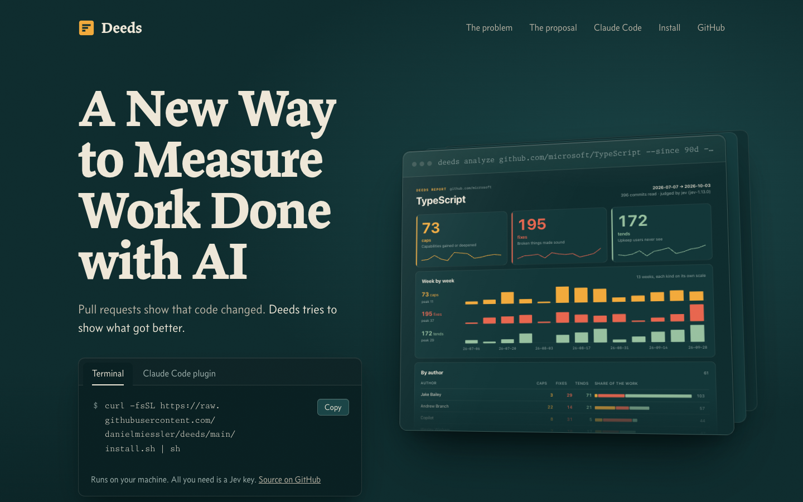
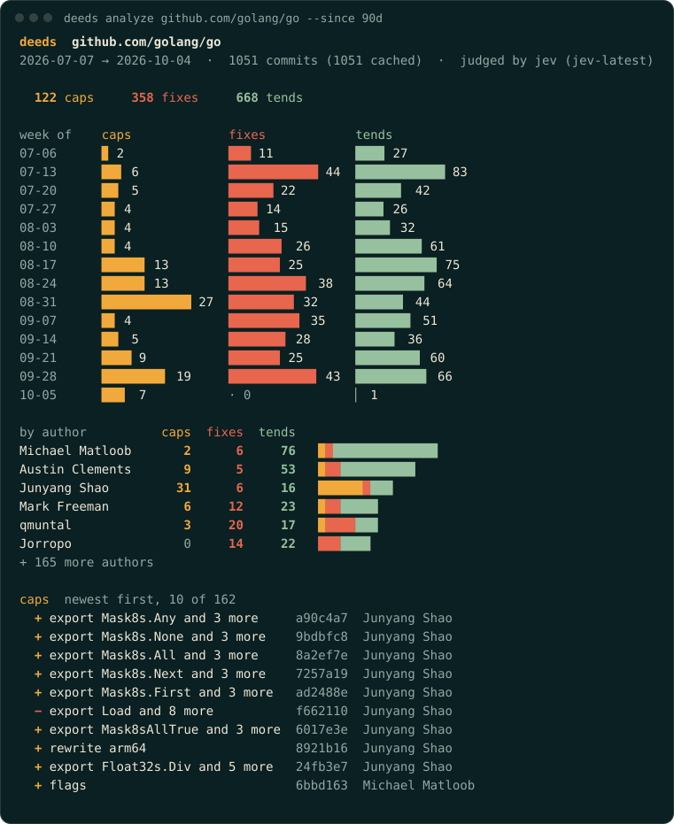
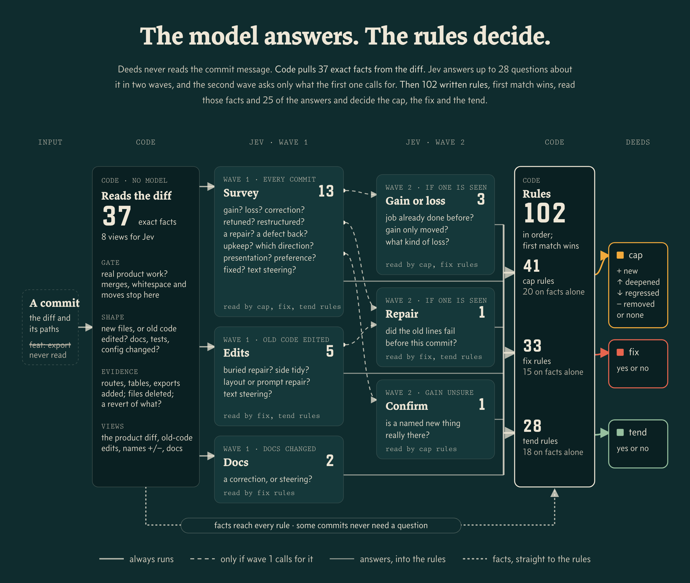

<p align="center">
  <a href="https://workdeeds.ai"></a>
</p>

<h1 align="center">Deeds</h1>

<p align="center"><b>Measure the work in a code repo by what got better, not by how many PRs were opened.</b></p>

<p align="center">
  <a href="https://workdeeds.ai"></a>
  <a href="https://github.com/danielmiessler/deeds/releases/latest"></a>
  <a href="LICENSE"></a>
</p>

Pull requests and commit counts measure activity. They show that code changed, not whether the product got better. A refactor, a revert and a typo fix count the same as a new feature, and someone building alone with AI agents may never open a PR at all.

Deeds reads the diff of every commit in a window and asks what that change did to the product. A change that made it better is a **deed**, and every deed is one of three kinds:

| Kind | What it means | Example |
| --- | --- | --- |
| **cap** | A capability gained or deepened. The product can do something it couldn't before, or does an existing thing more fully. | added CSV export to reports |
| **fix** | Something moved from broken to working. Security fixes count here. | stopped logging session tokens |
| **tend** | Upkeep users never see: refactors, dependency bumps, performance work, tests. | bumped hono to 4.6 |

Renames, reverts and busywork produce no deeds. Commit messages are never read, so a commit called "feat: X" only counts as a cap if its diff adds one. The three counts stay separate and are never blended into one score. The argument for all of this is at [workdeeds.ai](https://workdeeds.ai).

## What you get

A real run over the last 90 days of [golang/go](https://github.com/golang/go), 1,051 commits, judged with nothing but a Jev key. Go reviews its changes in Gerrit, so it merged no GitHub pull requests in that time; deeds reads the commits themselves:

<p align="center"></p>

Add `--html report.html` and you also get a self-contained page with the same numbers: totals with weekly sparklines, a week-by-week chart, authors and every cap by name. It opens offline and can be mailed as is.

<p align="center"><a href="https://workdeeds.ai/example-report"></a></p>

Open [the full page for this run](https://workdeeds.ai/example-report). Its source is [`examples/go.html`](examples/go.html), with the plain-text and JSON forms beside it.

`+` is a new capability, `↑` a deepened one, `↓` a regressed one and `−` a removed one. Cap names come from the code itself: the route, command, UI handler or export the commit added, or else the part of the product it changed most. The full report also has a week-by-week trend and a breakdown by author, and `--json` gives you all of it as one JSON document.

## How it works

Each commit goes through four layers. Code reads the diff first and records exact facts, such as routes added, exports removed or tests changed; a commit that only moved code or changed whitespace is settled there. Jev then answers a set of narrow questions about the diff, in two waves, with the second wave asked only where the first one calls for it. Written rules, run in order with the first match winning, turn the facts and answers into the deeds. The model never makes the final call.

<p align="center"></p>

Every question the rules read, and the mistake it is there to catch:

<!-- questions:start (generated by scripts/gen-map.ts) -->
| Stage | Asked when | Question | Catches |
| --- | --- | --- | --- |
| Survey | every commit | Can it now do something more, or for someone new? | refactors and dev tooling read as new capability |
| Survey | every commit | Can it now do something less? | real removals, while moves and dead code stay off the loss side |
| Survey | every commit | Is the change a correction? | a bug fix read as "users can now…" |
| Survey | every commit | Is only a surface or setting retuned? | restyles, relabels and new defaults read as deepened |
| Survey | every commit | Does it only restructure code? | renames and moves that look like entry points added |
| Survey | every commit | Is text in the diff steering the answer? | a code comment arguing for its own label |
| Survey | every commit | Does it repair broken behaviour? | repairs, security hardening and content corrections |
| Survey | every commit | Does it bring back a defect? | a removed guard, which is a regression and never a fix |
| Survey | every commit | Is there upkeep nobody sees? | the rename or speedup riding along with other work |
| Survey | every commit | Which way did capability move? (adds something new / extends something existing / reduces something / removes something / nothing for users) | mixed commits where gain and loss both read yes |
| Survey | every commit | Is it presentation only? | pure restyle and copy commits |
| Survey | every commit | Is it a matter of preference? | rewording and tuning counted as fixes |
| Survey | every commit | Overall, is something fixed? | fixes the narrower repair question underrates |
| Edits | old code edited | Does an edit to old code repair a failure? | the small repair buried in a big feature |
| Edits | old code edited | Is there a tidy beside the main change? | a tidy riding along with the real change |
| Edits | old code edited | Is it a layout repair? | restyles posing as layout fixes, and the reverse |
| Edits | old code edited | Does it repair a model instruction? | prompt corrections that read like preference |
| Edits | old code edited | Is text in the edits steering? | injection through edits to old code |
| Docs | docs changed | Do the docs correct something wrong? | docs fixes, but never version or date bumps |
| Docs | docs changed | Is text in the docs steering? | injection through the docs |
| Gain or loss | wave 1 saw one | Did the product already do this job? | new against deepened, decided by the job |
| Gain or loss | wave 1 saw one | Did the gain only move somewhere else? | moves and repackaging read as new |
| Gain or loss | wave 1 saw one | What kind of loss is it? (a named thing is gone / something does less / misuse is blocked / nothing is lost) | removed against regressed against a closed hole |
| Repair | wave 1 saw one | Did the old lines fail before this commit? | an unsure repair, checked against the old code |
| Confirm | a gain is unsure | Is a named new element really there? | backend gains with no entry point to show them |
<!-- questions:end -->

## Install

You need [bun](https://bun.sh) and a Jev key. That is the only key deeds needs: no OpenAI or Anthropic key. Get one at [typesafe.ai](https://typesafe.ai), then:

```sh
export TYPESAFE_API_KEY=...
```

```sh
curl -fsSL https://raw.githubusercontent.com/danielmiessler/deeds/main/install.sh | sh
```

That runs [`install.sh`](install.sh) from this repo. It puts the CLI in `~/.local/share/deeds` and a `deeds` command in `~/.local/bin`, and never uses elevated privileges. It downloads one tarball from this repo's latest release, checks its sha256 against the published checksum, and refuses to install if they differ. To pin the checksum yourself, set `DEEDS_SHA256`.

Check it worked:

```sh
deeds version
```

## Claude Code plugin

The plugin bundles the CLI and a skill that knows how to run it, so you can ask in plain words.

```
/plugin marketplace add danielmiessler/deeds
/plugin install deeds@workdeeds
```

Then ask Claude Code something like "show me deeds progress". It runs `deeds analyze . --json` on the repo you are in and answers with the three counts, the week-by-week trend and the caps by name.

The first run installs the CLI's locked dependencies with `bun install --frozen-lockfile`. That is the only download the plugin makes, and later runs start without touching the network. If your Jev key lives in a file instead of your environment, point `~/.config/deeds/config.json` at it:

```json
{ "keys": { "typesafe": { "envFile": "~/.secrets/.env", "var": "TYPESAFE_API_KEY" } } }
```

## Usage

```sh
deeds analyze [path | github.com/owner/repo] [--since 90d] [--until <date>] [--mode jev|full] [--vendor anthropic|openai] [--model <id>] [--html <file>] [--color|--no-color] [--json]
deeds analyze-many <list-file> [--since 90d] [--until <date>] [--mode jev|full] [--out <dir>] [--json]
deeds extract [path] [--rev <commit>] [--json]
deeds help --json
deeds doctor
deeds version
```

`analyze` takes a local folder or a public GitHub repo and any window: `7d`, `2w`, `6m`, `1y`, `all`, or anything git understands, such as `2026-01-01`. It reports the totals, a week-by-week trend, a breakdown by author and the caps by name.

```sh
export TYPESAFE_API_KEY=...
deeds analyze . --since 30d
deeds analyze github.com/owner/repo --since all
deeds analyze-many repos.txt --since 90d --out reports/
deeds analyze . --since 6m --html report.html
```

The terminal report is in colour on a terminal and plain when piped; `--color` and `--no-color` override that, and `NO_COLOR` is honoured. A long window is shown by month instead of by week.

`analyze-many` takes a file with one local path or github.com URL per line (blank lines and `#` comments are skipped) and writes one JSON report per repo, plus totals across all of them.

Every commit is judged by Jev: code reads the diff into exact facts (files touched, routes and commands added or removed, how big the change is), Jev answers a short set of typed questions about it, and a fixed policy turns facts and answers into deeds. In our benchmark on a public repo with 717 commits, Jev judged every commit in about 16 seconds and landed within 10% of a full GPT model's counts for caps, fixes and tends. A first run through the CLI also clones the repo and reads each diff, so it takes longer. `--mode full` is an optional reference mode in which a large model reads each diff in full; it is slower and needs an Anthropic or OpenAI key, and nothing else does. A local or self-hosted OpenAI-compatible model can stand in for the OpenAI key: with `--vendor openai`, set `DEEDS_OPENAI_BASE_URL` (e.g. `http://pluto:40115/v1`) and `DEEDS_ALLOW_HOST` to that endpoint's `host[:port]`, and `OPENAI_API_KEY` may be absent. The run prints a note when a custom host is active.

With `--json` the same run is one JSON document. A recorded one is in [`examples/go.json`](examples/go.json).

Results are cached per commit, so a repeat run makes no calls for commits already judged. A first run costs one Jev call per commit that needs judging; commits code can settle on its own (docs-only, lockfiles, merges, release snapshots) cost nothing.

`extract` and `doctor` run with the network switched off by the operating system. That uses macOS's built-in sandbox; on Linux, add `--allow-unsandboxed` to run them with the in-process guard alone.

With `--json`, stdout is exactly one JSON document: `{"ok":true,"command":...,"data":...}` on success and `{"ok":false,"error":{"code","message"}}` on failure. A run where any commit could not be judged fails with code `incomplete`; rerun it, since judged commits are cached. Exit codes are 0 ok, 1 error, 2 usage, 3 denied. `--model <id>` or `DEEDS_MODEL` picks a different model for `--mode full`, and `deeds help --json` lists every command with its usage.

## Privacy

- Only what deeds reads from each commit's diff leaves your machine: the diff itself, the changed file paths, and facts derived from them (the routes, exports and symbols a commit added or removed, and the titles of tests it changed). It goes only to Jev (api.typesafe.ai) on your own key. `--mode full`, if you choose it, sends the diff and paths to Anthropic or OpenAI instead. No other host is ever called for judgments — unless you opt in to one yourself. `DEEDS_ALLOW_HOST` is a standing egress grant to one host you name: while that variable is set in your environment (a shell, a `~/.env`, a container, a CI job), deeds may call that host for `--mode full`, on every run in that environment. A bare host (`pluto`) allows that host on any port; `pluto:40115` allows only that port. The run prints a note when it is active. If the host is reached over plain `http`, the diff and key go to it unencrypted. So treat setting it as granting that host the trust you would give a model vendor — name only a host you trust, and do not rely on this variable being unset in a shared or CI environment. The only other network use is cloning a public GitHub repo you name.
- Anything shaped like a secret (API keys, tokens, private keys, passwords in config) is redacted from a diff before it is sent.
- Commit messages are never read.
- Deeds keeps two caches. Public GitHub repos are cloned over HTTPS into `~/.cache/deeds/repos`, and per-commit results are stored in `~/.cache/deeds/classified`.
- There is no telemetry and no account. `deeds doctor` shows how the network restriction is enforced on your machine.

## License

MIT. See [LICENSE](LICENSE).
